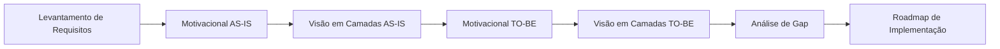

# 📚 Modelagem de Arquitetura Empresarial - Sistema de Biblioteca

Este repositório contém os exercícios práticos de modelagem de arquitetura empresarial para um sistema de biblioteca, utilizando o framework TOGAF e a notação ArchiMate.

## 🎯 Objetivo

Desenvolver modelos de arquitetura empresarial que representem a situação atual (AS-IS) e futura (TO-BE) de uma biblioteca, contemplando desde a camada estratégica até a infraestrutura de TI.

## 📋 Estrutura do Projeto

### 🔄 Exercícios de Modelagem

| Exercício | Descrição | Status |
|-----------|-----------|--------|
| [01 - Motivacional AS-IS](./01-motivacional-as-is/) | Modelo da situação atual com stakeholders, drivers, assessments e processos | ✅ |
| [02 - Motivacional TO-BE](./02-motivacional-to-be/) | Modelo da situação futura com objetivos, princípios e requisitos | ✅ |
| [03 - Visão em Camadas AS-IS](./03-visao-camadas-as-is/) | Arquitetura atual em camadas (Negócios, Aplicação, Infraestrutura) | ✅ |
| [04 - Visão em Camadas TO-BE](./04-visao-camadas-to-be/) | Arquitetura futura com novo sistema e infraestrutura em nuvem | ✅ |

## 🏛️ Cenário da Biblioteca

### 📊 Situação Atual (AS-IS)
- **Stakeholders**: Atendente, Usuários, Fornecedores
- **Problemas identificados**: 
  - Acervo limitado
  - Demora no atendimento manual
  - Dependência de planilhas eletrônicas
- **Processos**: Adquirir livros, Cadastrar usuários, Cadastrar livros, Reservar, Emprestar, Devolver

### 🎯 Situação Futura (TO-BE)
- **Objetivos**: 
  - Melhorar tempo de atendimento
  - Aumentar o acervo
  - Migrar para nuvem (AWS/Azure)
- **Requisitos**: Estar na nuvem, boa usabilidade e acessibilidade, bom suporte técnico, custo-benefício
- **Restrições**: Limitação de até 5 obras por usuário, SLA de 48 horas, utilizar CPF no cadastro

## 🛠️ Ferramentas e Metodologia

- **Framework**: TOGAF (The Open Group Architecture Framework)
- **Notação**: ArchiMate 3.1
- **Abordagem**: Modelagem AS-IS seguida por TO-BE para análise de gap e planejamento de transformação

## 📚 Elementos ArchiMate Utilizados

### Camada de Motivação
- **Stakeholder** 👥 - Partes interessadas
- **Driver** ⚙️ - Diretrizes estratégicas  
- **Assessment** 🔍 - Avaliações/Problemas identificados
- **Goal** 🎯 - Objetivos
- **Principle** 📜 - Princípios orientadores
- **Requirement** 📋 - Requisitos funcionais e não-funcionais
- **Constraint** 🚫 - Restrições e limitações

### Camada de Negócios
- **Business Actor** 👤 - Atores de negócio
- **Business Role** 🎭 - Papéis e responsabilidades
- **Business Process** 🔄 - Processos de negócio
- **Business Service** 🎪 - Serviços de negócio

### Camada de Aplicação
- **Application Component** 💻 - Componentes de aplicação
- **Application Service** 🌐 - Serviços de aplicação

### Camada de Tecnologia
- **Node** 🖥️ - Nós de infraestrutura
- **Device** 📱 - Dispositivos físicos
- **System Software** ⚙️ - Software de sistema
- **Technology Service** 🔧 - Serviços de tecnologia

## 🎓 Principais Aprendizados

Este projeto demonstra:

1. **Análise Situacional**: Como mapear a situação atual identificando problemas, limitações e oportunidades
2. **Visão de Futuro**: Como definir objetivos claros, princípios e requisitos para orientar a transformação
3. **Arquitetura em Camadas**: Como organizar elementos arquiteturais em diferentes níveis de abstração
4. **Relacionamentos ArchiMate**: Como conectar elementos respeitando o metamodelo e as regras de derivação
5. **Análise de Gap**: Comparação entre AS-IS e TO-BE para identificar lacunas e necessidades de mudança

## 📖 Como Navegar

Cada pasta contém:
- **README.md**: Explicação detalhada do exercício, elementos utilizados e decisões de modelagem
- **assets/**: Imagens dos modelos criados em alta resolução
- **docs/**: Documentação complementar quando aplicável

**Recomendação**: Comece pelo [01 - Motivacional AS-IS](./01-motivacional-as-is/) e siga a sequência numerada para acompanhar a evolução natural da modelagem.

## 🔄 Fluxo de Trabalho

## 👨🏫 Créditos

**Professor**: Fernando Zaidan  
**Instituição**: PUC Minas  
**Disciplina**: Arquitetura Empresarial

## 📝 Licença

Este projeto é desenvolvido para fins educacionais como parte do curso de Arquitetura Empresarial da PUC Minas.